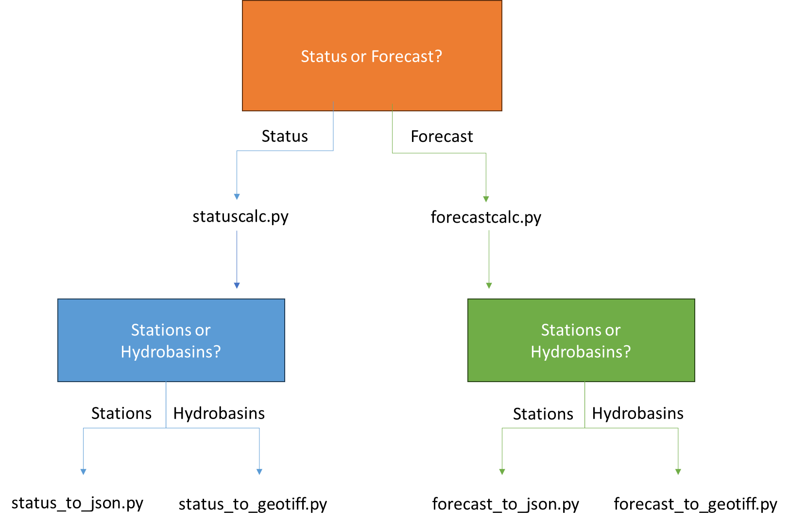

# Hydrological Status and Outlook System

Hydrological Status and Outlook System (HydroSOS). This repository contains code to facilitate common categorisation of status and forecast data for integration into the HydroSOS portal.
Use the flowchart below to identify the scripts appropriate for your data. 

If your data is ***status*** run ```status/statuscalc.py``` followed by ```status/status_to_json.py``` for ***station data*** or ```status/status_to_geotiff.py``` for ***hydrobasin data***.

If your data is ***forecast*** run ```forecast/forecastcalc.py``` followed by ```forecast/forecast_to_json.py``` for ***station data*** or ```forecast/forecast_to_geotiff.py``` for ***hydrobasin data***.



On the HydroSOS web portal, the monthly category .csv files for each station/hydrobasin (produced by statuscalc.py/forecastcalc.py) are displayed in timeseries graphs, whereas the .json/.geotiff files for each month are visualised on the map. 

## Status  

### ```status/statuscalc.py```
This Python code is run from the terminal. It requires Python 3 and the ```pandas``` and ```numpy``` libraries. 
The Python code can process multiple files in one go. 

It should be used as follows:


``` python statuscalc.py input_directory output_directory --startYear --endYear ```

For example: 

``` python status/statuscalc.py ./example_data/status/input/ ./example_data/status/output/output_Python/ --startYear 1990 --endYear 2020 ```


Where:
*  ```input_directory``` is the directory containing the .csv timeseries to be processed. The script will attempt to parse every .csv file in this directory, so remove any .csv files you don't want to be processed. See files in [example_data/status/input](./example_data/status/input) for how these files should look.
* ```output_directory``` is the directory the processed .csv files will be written to. They will have the same name as files in the input_directory but with ```cat_``` appended to the start of the name.
* ```--startYear``` an optional argument, which year to use as the start range to calculate the reference average value. Each monthly value is divided by this reference average before calculating percentile rank and status.
* ```--endYear``` an optional argument, which year to use as the end range to calculate the reference average value. Each monthly value is divided by this reference average before calculating percentile rank and status. 

### ```status/status_to_json.py```
A Python script that converts the csv outputs of the StatusCalc Python/R script to json files for use in the HydroSOS web portal is also provided. It can process multiple files in one go.

 It should be used as follows: 
``` python status_to_json.py input_directory output_directory```

For example: 
```python status/status_to_json.py ./example_data/status/output/output_Python ./example_data/status/output/output_json```

Where:
*  ```input_directory``` is the directory containing .csv status outputs from the python/R script with the name ```cat_stationID.csv```, this naming convention must be adhered to for the script to work. The script will attempt to parse every .csv file in this directory, so remove any .csv files you don't want to be processed. See files in [example_data/status/output_Python](./example_data/status/output_Python) for how these files should look.
* ```output_directory``` is the directory the processed .csv files will be written to. They will be named based on the dates of the data being processed. 


### ```status/status_to_geotiff.py```
A python script that converts the csv outputs of the statuscalc script into geotiff.

## Forecast

### ```forecast/forecastcalc.py```

This repository contains Python code to convert monthly forecast data into categories. This can be done using the ```forecastcalc.py``` script which should be run as follows: 

``` python forecastcalc.py obs_dir forecast_dir output_dir --obsDirStartingMonth --varName```

Where:

* ```obs_dir``` contains ONLY .csv files of historic status (observed simulated) data, as daily time series. Filenames should be formatted X_CATCHMENTID.csv
* ``forecast_dir`` contains ONLY .csv files of forecast data for different ensemble members. Filenames should be formatted X_ENS_CATCHMENTID.csv
* ```output_dir``` is the name of the directory to output processed files to.
* ```--obsDirStartingMonth``` starting month in the ObsDir dataset (default 1).
* ```--varName``` variable name in your input data files (default 'Discharge')

This script will calculate the categories (same as those in StatusCalc) that the forecasts belong to, based on both single and accumulated forecasts (results are saved into different subdirectories of output_dir).

Example: 

```python forecast/forecastcalc.py example_data/forecast/input/obs_dir example_data/forecast/input/forecast_dir  example_data/forecast/output/```

### ```forecast/forecast_to_json.py```

A Python script that converts the csv outputs of the forecastcalc.py script to json files for use in the HydroSOS web portal is also provided. It can process multiple files in one go.

Use as follows:

```python forecast_to_json.py input_directory output_directory```

Where input directory is the ```counts``` directory in the output of ```forecasts/forecastcalc.py```.

For example:

```python forecast/forecast_to_json.py example_data/forecast/output/single/counts example_data/forecast/output/single```

### ```forecast/forecast_to_geotiff.py```

The ```counts.csv``` file produced by forecastcalc.py should be further processed into a .geotiff for visualisation on the portal map. This can be done using ```forecast_csv_to_geotiff.py``` which is run as follows:

```python forecast_to_geotiff.py input_dir output_dir shapefile forecast_start_date --forecast_length```

Where:
*  ```input_dir``` is the ```counts``` directory produced by ```ForecastCalc.py``` that contains the forecast category counts for different months
* ```output_dir``` is where the geotiffs are written
* ```shapefile``` is a path to the shapefile that defines the polygons corresponding to the forecast ID boundaries that will be drawn in the geotiff
*  ```forecast_start_date``` is the first forecast date formatted ```YYYY-MM``` 
*  ```--forecast_length``` is the number of months forecasts were made for (default 6).

Example: 

```python forecast/forecast_to_geotiff.py example_data/forecast/output/accumulated/ example_data/forecast/output/output_geotiff/ example_data/basins.shp 2024-02 --forecastLength 6```

Info:

The HydroBasins shapefile can be downloaded here: https://www.hydrosheds.org/products/hydrobasins#downloads, note each continental shapefile will need to be merged to create a global shapefile. Download of merging of the Hydrosheds Hydrobasins data can be done using ```other/merge_hydrobasins.py```. 

## Other

### ```other/merge_hydrobasins.py```

The Python script ```other/merge_hydrobasins.py``` provided in this repo will download and merge level 04 Hydrosheds Hydrobasins (from the link above) and merge them a single shapefile. 

It should be run as follows:

```python merge_hydrobasins.py directoryPath --download 1```

Where: 

* ```directoryPath``` is a path to where the shapefiles should be written to/read from.
* ```--download``` is an optional argument, if it is set to ```1``` (default 0) the shapefiles will be downloaded to ```directoryPath```, else it is assumed the directory already contains the shapefiles to be merged.

Info:

This script will write a shapefile called ```merged_hydrobasins_level04.shp``` to ```directoryPath```. 

